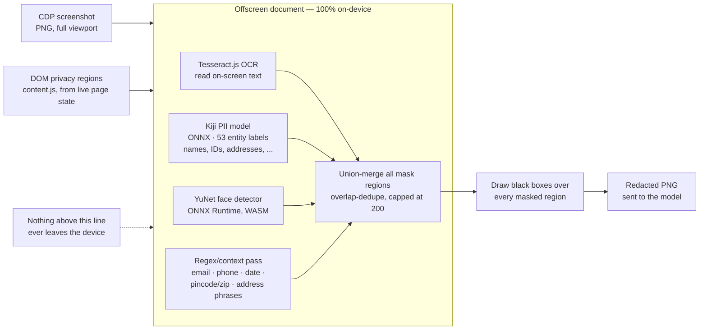
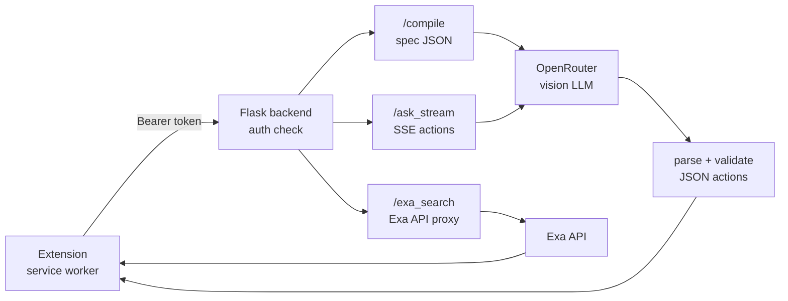
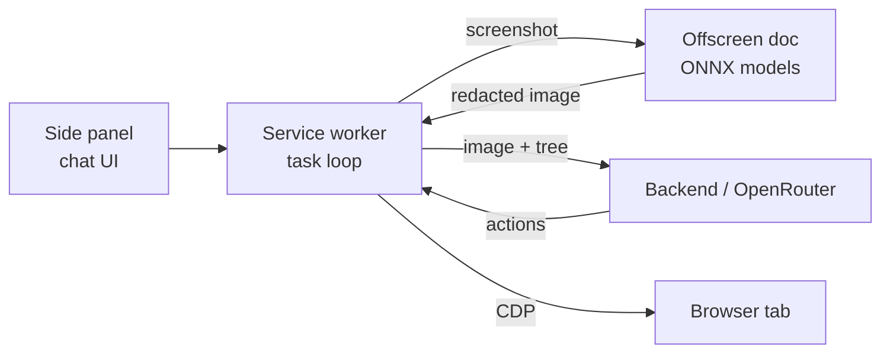
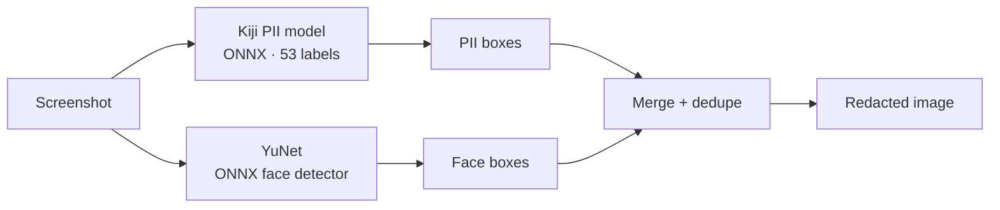

  

# Cleo

Cleo sits in your Chrome side panel and browses the web for you. Tell it what you want in plain English — "find the cheapest Sony headset, filter by hybrid, give me the top 5" — and it looks at the page like you would, decides what to click or type next, and just does it.

The part most browser agents skip: before a single screenshot leaves your machine, Cleo blacks out anything that looks like PII, names, emails, phone numbers, addresses, IDs — using a model that runs **entirely on-device**. It can still click and type into those fields, it just can't *read* them, and neither can the model on the other end.

Want it to actually go find something instead of guessing from memory? Flip on **Research mode**, Cleo opens real tabs, reads real pages, cites what it finds, and comes back with a proper sourced answer. Web search along the way runs through **Exa** by default, instead of the old "open Google, scroll the results" routine, one API call, real highlights, done.

  

## See it in action

<table>
<tr>
<td width="50%">

 
The side panel — chat stream, collapsible reasoning, and a screenshot for every step Cleo takes.
</td>
<td width="50%">

 
Cleo out in the wild — reading a real page and deciding what to do next.
</td>
</tr>
<tr>
<td width="50%">

 
Research mode — real sources, not a guess. Every claim traces back to a page it actually opened.
</td>
<td width="50%">

 
Bring your own OpenRouter key (and Exa key) or just use the built-in backend — your call.
</td>
</tr>
</table>

  
   
  Vision-driven means it's not stuck to forms and buttons — canvas works too.

## PII redaction pipeline

Four independent local detectors, union-merged, before a single pixel leaves the machine.

## Compact overviews

Slide-sized versions of the above — one component at a time.

**Backend**

**Client + ONNX**

**ONNX redaction**

- **Task compiler** — an intermediate model turns vague requests into a structured spec (goal, task type, success criteria, constraints, ambiguities) once per task; follow-ups re-compile against the existing spec. It can run a stronger/pricier model than the per-step loop (`OPENROUTER_COMPILATION_MODEL`), since it runs once per task instead of once per step. The vision model checks every screen against the success criteria, which makes "done" a checkable condition instead of a feeling.
- **Research mode** — a dedicated button that forces real browsing over answering from the model's own training knowledge: it must open and read at least one real source (found via `exa_search`, or a site-specific destination like YouTube/Reddit/a marketplace/Wikipedia when that fits the question better) before it's allowed to answer, enforced deterministically in code, not just requested in the prompt. Ends with a detailed, source-attributed report and an automatically-compiled sources list.
- **Web search (`exa_search`)** — the default way the agent looks things up, in both normal and research mode: one Exa API call returns real page titles/URLs/highlights, replacing "navigate to a search engine, then scroll the results." Normal mode uses `type: "auto"`; research mode uses `type: "deep"`. Routes through the backend's own `EXA_API_KEY` by default; in direct mode it uses the user's own Exa key from settings (optional), or falls back to a traditional `open_tab` Google search if no key is set or the Exa call errors. It's a discovery step, not a source: the same deterministic gate that guards research mode also blocks an answer/done coming right off exa_search's snippets in *any* mode, until the agent has actually `open_tab`'d a result and `remember`'d something from the page itself.
- **Per-chat isolation** — each chat has its own state (tab, tab pool, history, findings, step counter, spec, mode); multiple chats run in parallel on different tabs.
- **Resumable** — steps persist immediately; if the service worker is recycled, interrupted tasks auto-resume.
- **Self-healing** — debugger re-attach, new-tab adoption, tab-foreground activation, restricted-page redirect, screenshot fallbacks, backend watchdog, offscreen retry.
- **Notified** — desktop notification when a background chat finishes.
- **Fail-safe redaction** — OCR + ONNX PII model + ONNX face detector + regex/DOM regions are union-merged; PII never leaves the machine unmasked.
- **Two ways to reach the model** — a local Flask backend behind a demo Bearer-token auth, or bypass it entirely and call OpenRouter directly with your own key (mirrors the backend's prompts exactly; both paths kept in sync).

## Features

- Task compiler: an intermediate model turns vague requests into a structured spec — goal, task type, success criteria, constraints, ambiguities — so "done" is checkable, not a feeling
- Research mode: a dedicated button that searches via Exa and opens tabs across the right sites for the question (YouTube/Reddit/marketplaces/Wikipedia when that fits better than a general search), is deterministically blocked from answering until it has actually read a real source, and finishes with a detailed, sourced report
- Exa-powered web search (`exa_search`) as the default lookup in both modes — real highlights in one API call instead of opening a search tab and scrolling; falls back to a traditional Google search if no key/an error occurs
- Chrome side-panel chat interface with streaming responses, stick-to-bottom scrolling
- Collapsible per-message reasoning: screenshot + note + commands for every step
- Settings panel: swap the backend for a direct OpenRouter connection with your own key (optionally your own Exa key too), set the auth token, customize Cleo's display name and your avatar gradient
- Multiple chats, running in parallel, persisted locally (`unlimitedStorage`)
- Auto-titled chats, desktop notifications on completion
- 20+ browser actions: click, type, key combos, scroll, drag, hover, select, navigate, back/forward, download, PDF export, clipboard, read_text, scroll_into_view, remember
- Works on background tabs (CDP input + renderer screenshots); auto-redirects off new-tab/chrome:// pages before starting
- Research workflow: open items → remember facts (with source URL) → return to list → summarize top N
- Anti-stall: no-progress detection, scroll-run detection, tab-pool-loop detection, empty-response detection, ungrounded-answer gate (research mode or exa_search use), backend watchdog, auto-resume

## How Cleo compares

Where does it actually sit next to everything else in this space?

| | Cleo | Cloud agents (OpenAI Operator, Anthropic Computer Use) | Privacy proxies (Kiji Privacy Proxy) | Forked browsers (BrowserOS, Nanobrowser) | Orchestrator extensions (browser-use style) |
|---|---|---|---|---|---|
| Where it runs | Chrome extension (side panel) | Cloud VM / sandboxed browser | Local proxy between app & API | Separate Chromium fork | Extension or script harness |
| PII handling | On-device ONNX redaction of screenshots + DOM before sending | None — full page goes to the model | Masks text in API payloads | Depends on config | Usually none |
| Works in your real Chrome (sessions, logins, cookies) | Yes | No — separate sandbox session | N/A (proxy, not driver) | No — separate browser | Yes, but often script-driven |
| Vision-driven (works on canvas/complex UIs) | Yes | Yes | No (text payloads only) | Varies | Often DOM-only |
| Setup | Load unpacked + local Flask backend (or skip it — connect straight to OpenRouter with your own key) | Account + cloud | Desktop app install | Build/install a fork | pip/CLI + config |
| Model | Any vision model via OpenRouter (one key) | Vendor-locked | Vendor model (DistilBERT detector) | BYO key | BYO key |

**The short version:** cloud agents see everything and live outside your browser; privacy proxies protect API text but can't see or drive pages; forked browsers isolate you from your daily profile. Cleo is the middle path — a real extension in your real Chrome, where a local model scrubs the pixels and the DOM before a vision model decides what to do next.
