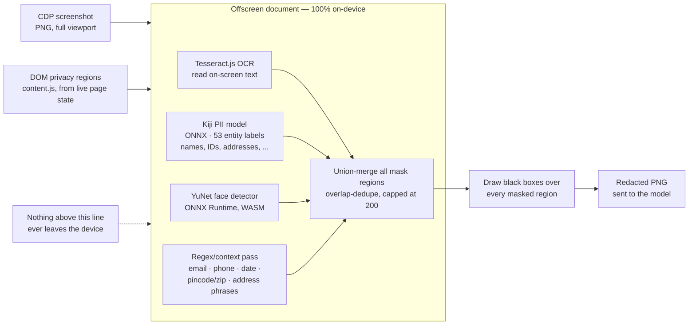
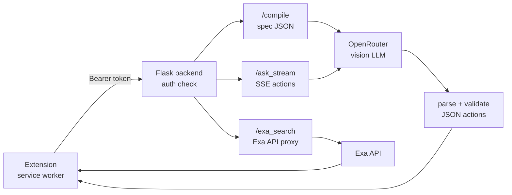
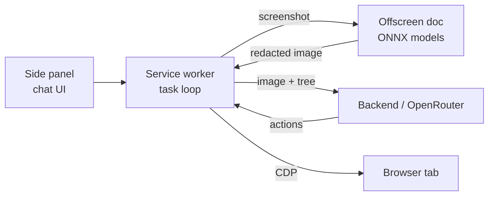
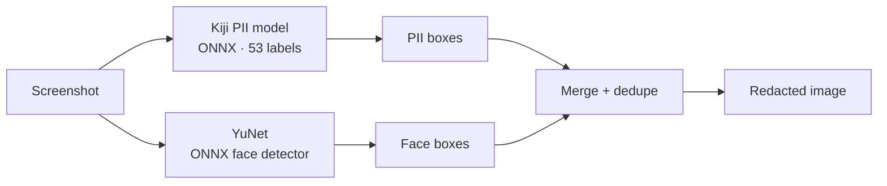

<p align="center">
  
</p>

# Cleo

Cleo sits in your Chrome side panel and browses the web for you. Tell it what you want in plain English, something like "find the cheapest Sony headset, filter by hybrid, give me the top 5", and it looks at the page like you would, decides what to click or type next, and does it.

The part most browser agents skip: before a screenshot leaves your machine, Cleo blacks out anything that looks like PII (names, emails, phone numbers, addresses, IDs) using a model that runs entirely on-device. It can still click and type into those fields, it just can't *read* them, and neither can whatever model is on the other end of the request.

There's also a Research mode for when you want it to actually go find something instead of answering from memory. It opens real tabs, reads real pages, and comes back with a sourced answer instead of a guess. Web search along the way runs through Exa by default rather than the usual "open Google, scroll the results page" routine, since one API call gets real page highlights back directly.

<p align="center">
  
</p>

## See it in action

<table>
<tr>
<td width="50%">

<br>
<sub>The side panel: chat stream, collapsible reasoning, and a screenshot for every step Cleo takes.</sub>
</td>
<td width="50%">

<br>
<sub>Reading a real page and deciding what to click next.</sub>
</td>
</tr>
<tr>
<td width="50%">

<br>
<sub>Research mode. Every claim in the answer traces back to a page it actually opened, not a guess.</sub>
</td>
<td width="50%">

<br>
<sub>Bring your own OpenRouter key (and Exa key), or just use the built-in backend.</sub>
</td>
</tr>
</table>

<p align="center">
  
  <br>
  <sub>It's vision-driven, so it's not stuck to forms and buttons. Canvas works too.</sub>
</p>

## Running it locally

You need the extension loaded in Chrome, and a way for it to reach a model. The bundled Flask backend is the quickest path.

**Backend**

```sh
cd backend
cp .env.sample .env
```

Fill in `.env`:

- `OPENROUTER_API_KEY`, required, get one at [openrouter.ai](https://openrouter.ai)
- `OPENROUTER_MODEL`, optional, defaults to `google/gemini-2.0-flash-001`
- `OPENROUTER_COMPILATION_MODEL`, optional, a stronger/pricier model for one-shot task compilation (runs once per task, not once per step), falls back to `OPENROUTER_MODEL` if unset
- `CLEO_AUTH_TOKEN`, optional, defaults to `9876543210`, change it if this backend is reachable beyond your own machine
- `EXA_API_KEY`, optional, powers `exa_search`; without it Cleo falls back to a plain `open_tab` Google search

Then, with [uv](https://docs.astral.sh/uv/) installed:

```sh
uv run main.py
```

That starts the backend on `http://127.0.0.1:5001`.

**Extension**

1. Open `chrome://extensions`, turn on Developer mode
2. Click "Load unpacked" and select the `extension` folder
3. Open the side panel, go to Settings, and check the auth token there matches what's in `.env` (or leave both at the `9876543210` default)

Would rather skip the backend entirely? Flip on direct mode in Settings and paste in your own OpenRouter key (and an Exa key, if you have one). Cleo then talks to OpenRouter straight from the extension, no server involved.

## PII redaction pipeline overview

Four independent local detectors, union-merged, before a single pixel leaves the machine.



## Compact overviews

Slide-sized versions of the above — one component at a time.

**Backend**



**Client + ONNX**



**ONNX redaction**



## Features

The core loop starts with a task compiler: an intermediate model turns a vague request into a structured spec (goal, task type, success criteria, constraints, ambiguities) once per task, and follow-ups re-compile against that same spec instead of starting over. It's allowed to run a stronger, pricier model than the per-step loop uses (`OPENROUTER_COMPILATION_MODEL`), since it only runs once. The point of the spec is that the model can check each screen against real success criteria, so "done" is something it can verify instead of just guess at.

Research mode is a separate button, not a toggle on the prompt. It has to open and read at least one real source (via `exa_search`, or a site it decides fits better, YouTube, Reddit, a marketplace, Wikipedia) before it's allowed to answer, and that's enforced in code, not just requested in a prompt. It ends with a written report and a sources list built from the pages it actually read.

Web search itself goes through Exa by default in both modes (normal uses `type: "auto"`, research uses `type: "deep"`), one call back with real page titles, URLs, and highlights, instead of opening a tab and scrolling a results page. No Exa key configured, or the call fails? It falls back to a plain `open_tab` Google search. Either way, Exa results are a discovery step, not a source: Cleo can't answer off search snippets alone in any mode, it still has to open a result and read it.

Everything else, in short:

- Chrome side-panel chat with streaming responses and collapsible reasoning (screenshot, note, and commands for every step)
- Multiple chats running in parallel, each with its own tab, tab pool, history, and step counter, persisted locally, auto-titled, and picked back up automatically if the service worker gets recycled mid-task
- Settings to swap the backend for a direct OpenRouter connection with your own key (and your own Exa key), set the auth token, and pick a display name and avatar gradient
- 20+ browser actions: click, type, key combos, scroll, drag, hover, select, navigate, back/forward, download, PDF export, clipboard, read text, remember
- Works on background tabs, and redirects off new-tab/chrome:// pages automatically before starting
- Notices when it's stuck (page hasn't changed in a few steps, too many scrolls in a row, juggling tabs without acting, an empty response) and nudges itself back on track instead of looping forever
- Self-healing around the fiddly parts of automating a real browser: the debugger reattaches if Chrome detaches it, new tabs get adopted, screenshot capture retries, the local backend gets a watchdog ping
- Desktop notification when a background chat finishes

## How Cleo compares

| | Cleo | Cloud agents (OpenAI Operator, Anthropic Computer Use) | Privacy proxies (Kiji Privacy Proxy) | Forked browsers (BrowserOS, Nanobrowser) | Orchestrator extensions (browser-use style) |
|---|---|---|---|---|---|
| Where it runs | Chrome extension (side panel) | Cloud VM / sandboxed browser | Local proxy between app & API | Separate Chromium fork | Extension or script harness |
| PII handling | On-device ONNX redaction of screenshots + DOM before sending | None — full page goes to the model | Masks text in API payloads | Depends on config | Usually none |
| Works in your real Chrome (sessions, logins, cookies) | Yes | No — separate sandbox session | N/A (proxy, not driver) | No — separate browser | Yes, but often script-driven |
| Vision-driven (works on canvas/complex UIs) | Yes | Yes | No (text payloads only) | Varies | Often DOM-only |
| Setup | Load unpacked + local Flask backend (or skip it — connect straight to OpenRouter with your own key) | Account + cloud | Desktop app install | Build/install a fork | pip/CLI + config |
| Model | Any vision model via OpenRouter (one key) | Vendor-locked | Vendor model (DistilBERT detector) | BYO key | BYO key |

**The short version:** cloud agents see everything and live outside your browser; privacy proxies protect API text but can't see or drive pages; forked browsers isolate you from your daily profile. Cleo is the middle path — a real extension in your real Chrome, where a local model scrubs the pixels and the DOM before a vision model decides what to do next.
